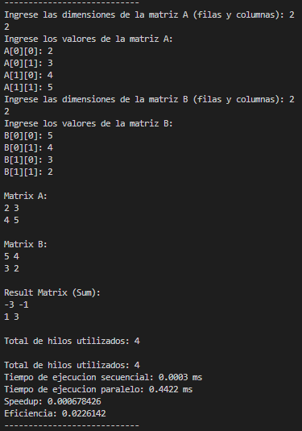

# Calculadora de matrices con programacion paralela

Sencillo programa encargado de hacer operaciones elementales con matrices, mediante este programa se puede evidenciar las ventajas de la programación paralela y concurrente. 

## Operaciones con matrices implementadas:
- Suma :white_check_mark:
- Resta :white_check_mark:
- Multiplicación :white_check_mark:

## Librerias usadas
- `<iostream>`: Es utilizada para realizar operaciones de entrada y salida a través de la consola.
- `<vector>` : Proporciona una implementación de arreglos dinámicos. Un vector es una estructura de datos que puede cambiar de tamaño dinámicamente y es similar a un array, pero más flexible.
- `<thread>` : Permite la creación y manipulación de hilos (threads) para lograr ejecución paralela y concurrente de este proyecto.
- `<atomic>` : Usada para declarar el contador de hilos, garantiza que las operaciones de incremento y decremento se realicen de manera segura en entornos multiproceso o multihilo.
- `<string>` : Esta clase es más fácil de usar y flexible que las cadenas de caracteres.

## Funcionamiento
- **Suma y resta**

  - `opcMatrixOperation()`
  
    - Validación de la operación.
    - Genera las dimensiones de la matriz resultante.
    - Aqui se definen el numero de hilos.
    - Invoca a `parallelMatrixOperation()`.
    - Imprime los operadores y el resultado.
    - Muestra métricas.
  
  - `parallelMatrixOperation()`
  
    - Aqui se define que operación usar (suma o resta) PD: se implementó ambas aquí debido a que no hay mucha diferencia en los calculos.
    - Se definen las filas por hilo (`rowsPerThread`), se calcula mediante la división de las filas de la primera matriz entre el numero de hilos (`numThreads`).
    - Todos los hilos menos uno se les asigna una cantidad de filas con las que trabajar.
    - Al ultimo hilo se le asignan las filas restantes.
  
  - `addMatrices()`
  
    - Se encarga de sumar las filas que le fueron asignadas.
    - Aqui se encuentra el contador de hilos.
  
  - `subtractMatrices()`
  
    - Se encarga de restar las filas que le fueron asignadas.
    - Aqui se encuentra el contador de hilos.

- **Multiplicación**

  - `opcMatrixMultiplication()`
  
    - Validación de la operación.
    - Genera las dimensiones de la matriz resultante.
    - Aqui se definen el numero de hilos.
    - Invoca a `parallelMatrixMultiplication()`.
    - Imprime los operadores y el resultado.
    - Muestra métricas.
  
  - `parallelMatrixMultiplication()`
  
    - Se definen las filas por hilo (`rowsPerThread`), se calcula mediante la división de las filas de la primera matriz entre el numero de hilos (`numThreads`).
    - Todos los hilos menos uno se les asigna una cantidad de filas con las que trabajar.
    - Al ultimo hilo se le asignan las filas restantes.
  
  - `multiplyMatrices()`
  
    - Se encarga de operar las filas que le fueron asignadas.
    - Aqui se encuentra el contador de hilos.
    
## Capturas

- **Suma**
  
  

- **Resta**

  

- **Multiplicacón**

  
